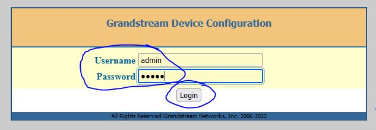
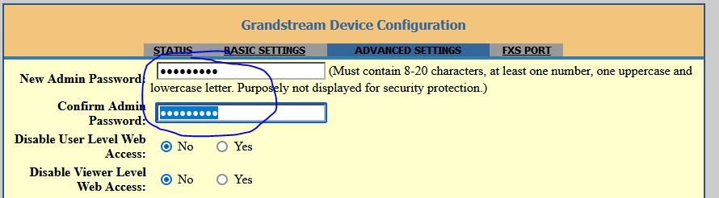
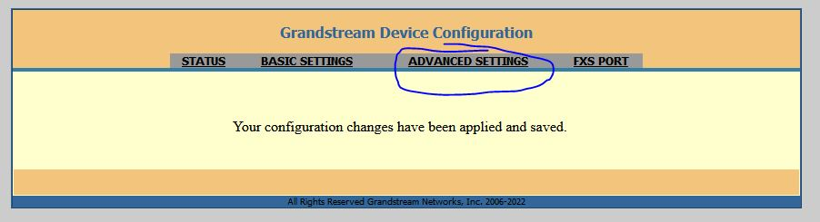

# Grandstream HT801 Factory Reset

We are primarily using Grandtream HT801 ATAs as they can be remotely configured and have build in OpenVPN connectivity so we have flexability with deployments.

## Factory Reset

Before we use the ATA we want to factory reset it.

Plug in the ATA so it receives power and locate the Reset button on the back between the power and ethernet ports.

Use something small like a paper clip or pen to hold the reset button down for 10 seconds. Do not release the button until all three blue lights on the top of the ATA flash twice.

## Password Reset

In your web browser, you will now want to visit the IP address of the ATA. If you have already configured your router, you have assigned the ATA an IP address of `192.168.1.2` so you can visit <http://192.168.1.2> through your browser.

You will be presented with a login screen. Enter `admin` into the *Username* field and `admin` into the *Password* field and then press the *Login* button.

On the *STATUS* page, use the top navigation to navigate to *ADVANCED SETTINGS*.

In the *New Admin Password* field and *Confirm Admin Password* field, enter a new password to access the ATA from using the `admin` account.

Then scroll down to the bottom of the page and press the *Apply* button.

On the confirmation page, use the top navigation to select *ADVANCED SETTINGS*.

Again, scroll all the way to the bottom and press the button for *Reboot*

After a few minutes the ATA will finish rebooting and you can access <http://192.168.1.2> in the browser again. Here, you can log in with the *Username* `admin` and the new password you just set.