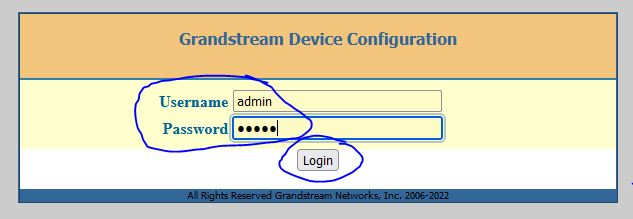
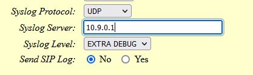

# Grandstream HT801 Logging

Let's get logs generated by the HT801 ATA into our RSyslog server.

## Configuring Syslog

In your web browser, you will  want to visit the IP address of the ATA. If you have already configured your router, you have assigned the ATA an IP address of `192.168.1.2` so you can visit <http://192.168.1.2> through your browser.

You will be presented with a login screen. Enter `admin` into the *Username* field and your password into the *Password* field and then press the *Login* button.

On the *STATUS* page, use the top navigation to navigate to *ADVANCED SETTINGS*.

On the *ADVANCED SETTINGS* page, set the `Syslog Protocol` to `UDP`, `Syslog Server` to the local VPN IP address running our RSyslog server, and set the `Syslog Level` and `Send SIP Log` to whatever is felt as appropriate.

Then scroll down to the bottom of the page and press the *Apply* button.

Logs will now send to Rsyslog!
