# Flashing OpenWRT on the GL-AR300M16

The GL-AR300M16 is a low cost "travel router" manufactured by GL.iNet that replaces the GL-AR300M. The main difference here seems to be that the GL-AR300M16 lacks any NAND memory so the 16MB NOR memory must be used. Unfortunately the original model is no longer available.

This device seems to be cost-effective at around $27 USD. This is around the same price as a used Archer A7/C7, which is a great router, but the GL device is much less power-hungry and incredibly small.

Note: This device is very different than the GL-MT300N-V2 (Mango) device even though they are offered at the same price point and seem to have an identical formfactor. Thile the GL-AR300M16 has a well supported Qualcomm Atheros QCA9531 chipset, the GL-MT300N-V2 has a MediaTek MTK7628NN chipset.

Official site: https://store.gl-inet.com/products/gl-ar300m16-mini-smart-router

## Flashing OpenWRT

We will be installing the powerful, open-source [OpenWRT](https://openwrt.org/) software on this router due to its performance, extensibility, and community support. Additionally, OpenWRT provides an identical interface regardless of underlying hardware so it would provide a seamless administrator experience even with heterogeneous hardware deployed in the field.

### Initial Flash

The AR300M16 can be flashed via the stock GL.iNet web interface. Connect an ethernet cable between your computer and the LAN jack on the router and navigate to <https://192.168.8.1> to login. **NOTE:** You may need to disable wireless on the computer you are using in order to access this router URL. I recommend skimming this document beforehand and downloading both the `initramfs` and `squashfs` firmware files listed below ahead of time.

Once in the web interface, pick a language and press the *Next* button.

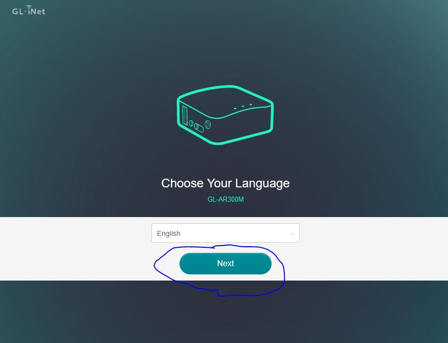

Now, set an administrator password and press the *Submit* password. This password does not matter as we will be installing new firmware anyway so just make it something you will remember.

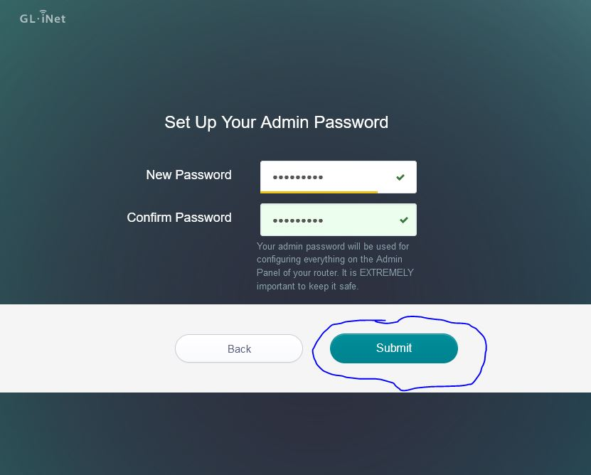

Use the left navigation to continue to the *Upgrade* page and choose the tab for *Local Upgrade*. 

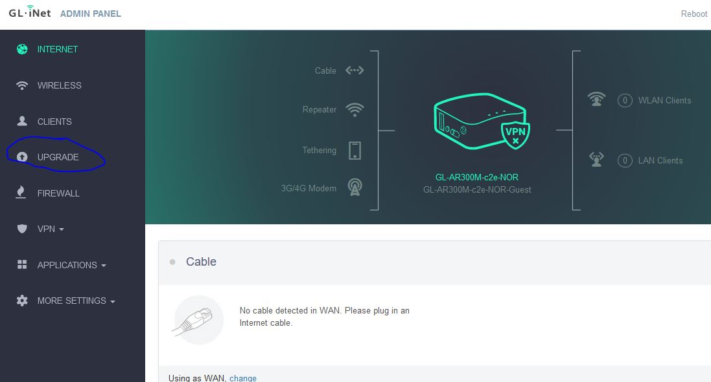

We will now want to flash an OpenWRT `initramfs` firmware image to the router so we need to download one. At the time of writing, https://downloads.openwrt.org/releases/22.03.2/targets/ath79/generic/openwrt-22.03.2-ath79-generic-glinet_gl-ar300m16-initramfs-kernel.bin was used.  After downloading the file, drag and drop it into the upload section on the page. This may take around ten seconds to upload.

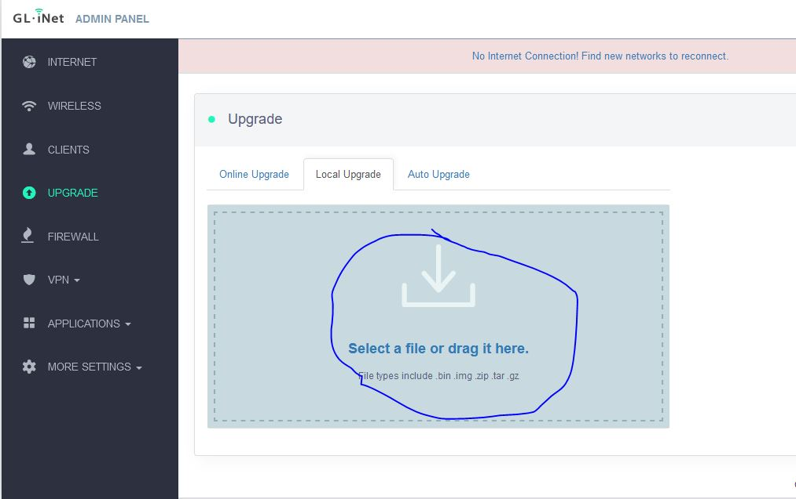

Next, uncheck the option for *Keep Settings*.

Finally, press the *Install* button and wait a few minutes for the firmware to be flashed. Do not unplug anything during this process.

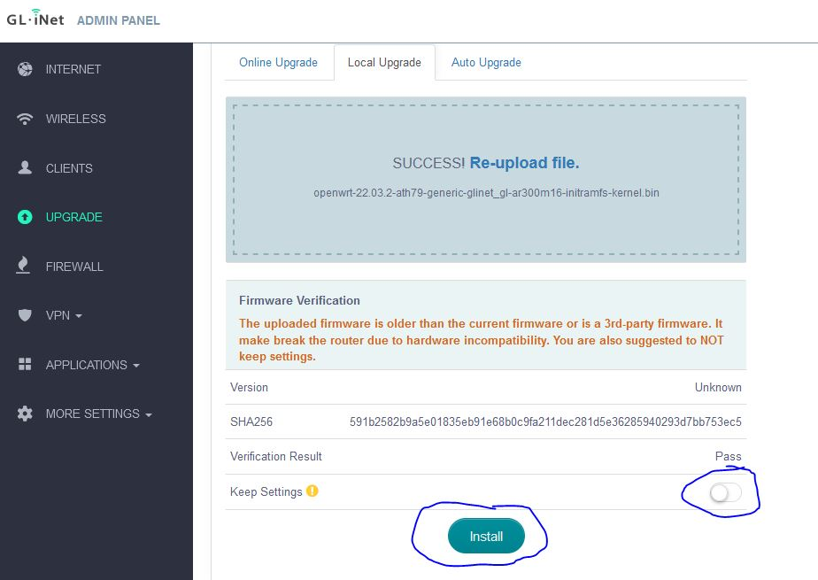

After a few minutes you should be able to access *luci* (OpenWRT's web interface) through http://192.168.1.1 and then you can proceed with the second flash.

### Second Flash

If all goes well, we will now want to flash with a `squashfs` image so we can make our changes persistent and not boot from a ramdisk. Bring up the  OpenWRT web interface by navigating to http://192.168.1.1 in your browser (if you get a security warning you are safe to accept the risk and continue).

Enter `root` as both the username and password and press the *Login* button.

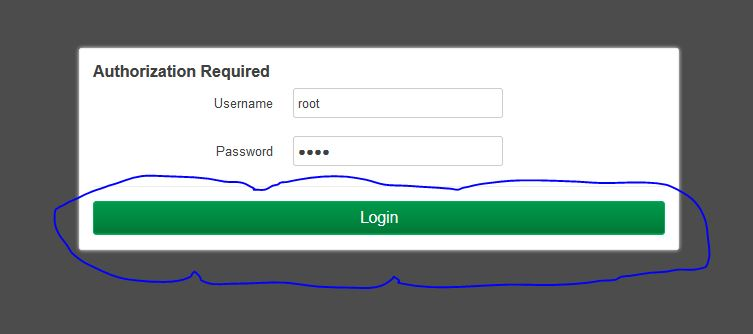

In the dashboard, navigate to *System* --> *Backup / Flash Firmware*.

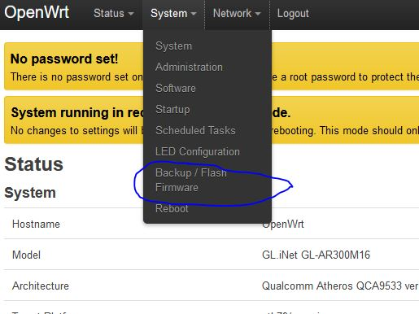

Scroll down to the *Flash new firmware image* section.

We will now want to flash an OpenWRT `squashfs` firmware image to the router so we need to download one. At the time of writing, we will use https://downloads.openwrt.org/releases/22.03.2/targets/ath79/generic/openwrt-22.03.2-ath79-generic-glinet_gl-ar300m16-squashfs-sysupgrade.bin

Press the button for *Flash image...*.

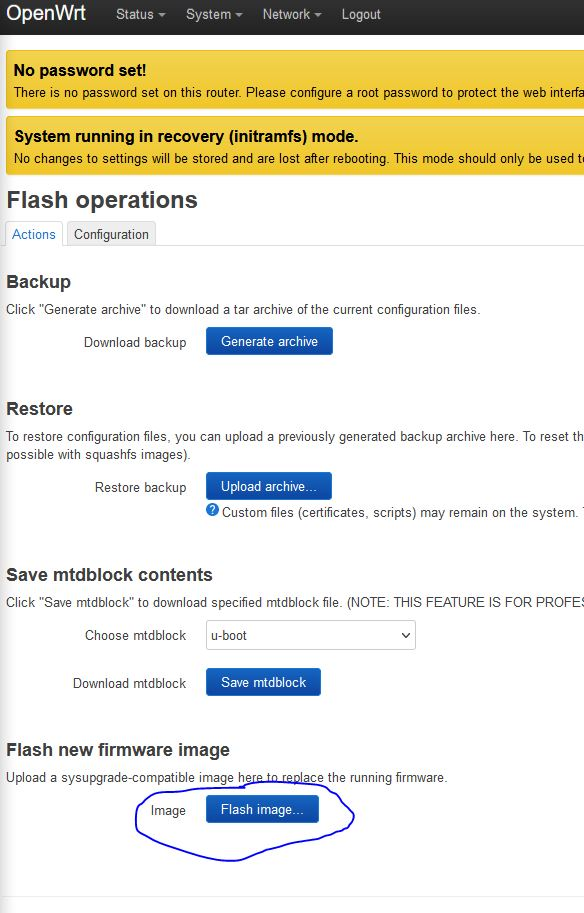

In the resulting popup, press the *Browse...* button and choose the squashfs image to flash with. Then press the *Upload* button.

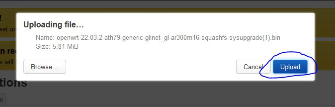

Uncheck the option for *Keep settings and retain the current configuration.* Finally, press the *Continue* button and flash the router. 

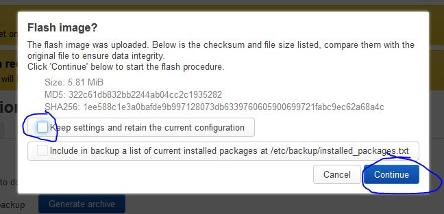

Do not unplug anything during this process. Again, this may take a few minutes but after some time the web interface should come back up at https://192.168.1.1

## Set root Password

Before we wrap up, be sure to set the root password. Navigate to https://192.168.1.1 to access the router and log in using `root` as the username and password. Once logged in, navigate to *System* --> *Administration*. 

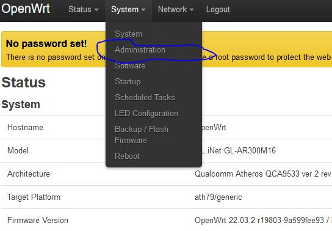

Then on the *Router Password* tab, enter a password and a confirmation before pressing the *Save* button.

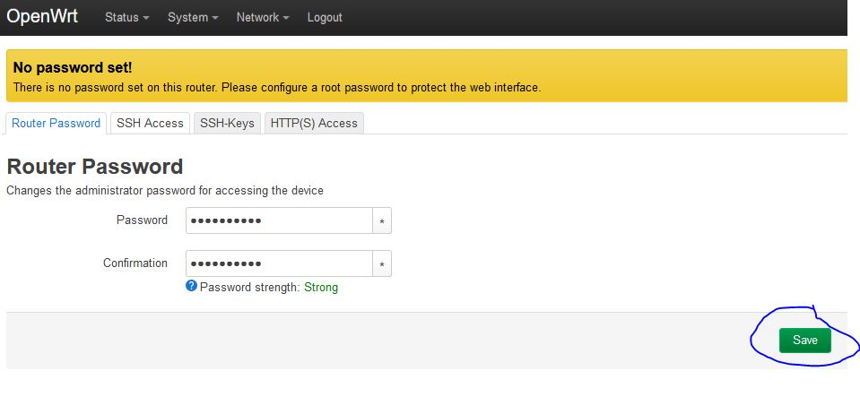