# Configuring the GL-AR300M16 as a Routed Client

In some cases, the WAN connection for the router may not be provided via ethernet cable and a WWAN connection will need to be performed so the router can get Internet access via an existing wireless network at the installation site.

## Configure the Network

Login to the router at <https://192.168.1.1/> and proceed to *Network* --> *Wireless*. 

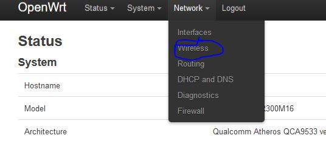

Here you will see an entry for `radio0,` now press the *Scan* button to get a list of available wireless networks. 

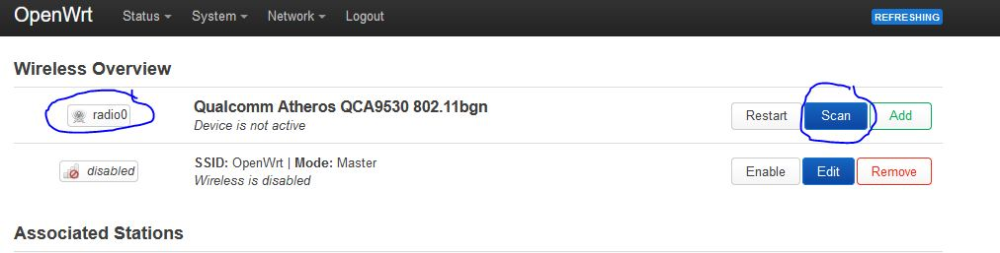

Find the one you would like to use and press the *Join Network* button next to it.

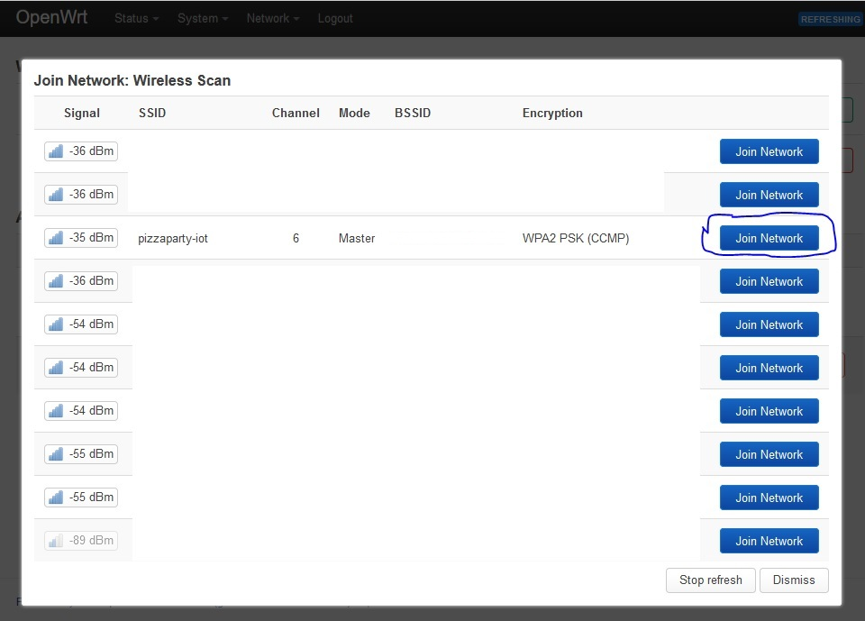

On the *Joining Network* dialog, check the box for *Replace wireless configuration*, ensure the network name is `wwan` and enter the passphrase to access the network. In *Create / Assign firewall-zone*, be sure that the `wan` zone is selected before pressing the *Submit* button. 

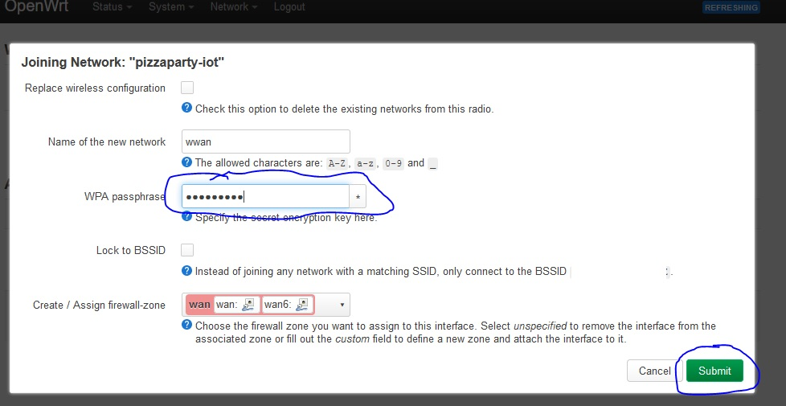

On the following dialog the defaults should be enough to establish connection, so press the *Save* button. In some cases you may need to edit the *Wireless Security* section to ensure the proper encryption is set.  

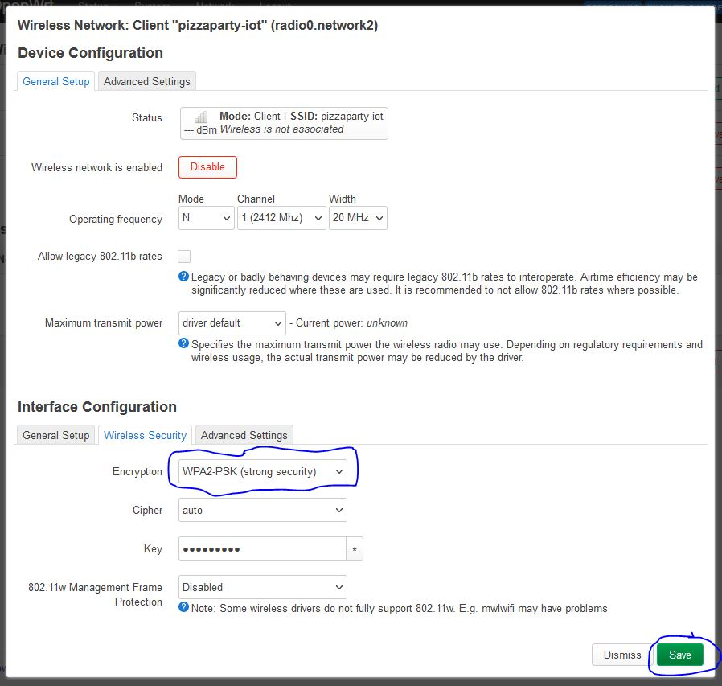

After the dialog closes, press the *Save & Apply* button and after a few seconds of waiting the router should connect to the network and display connection status in the *Associated Stations* section of the page.

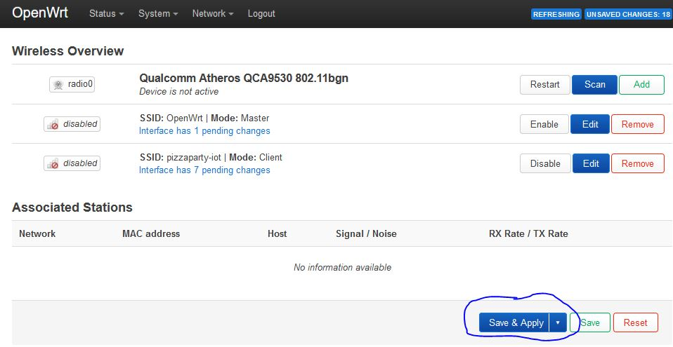

## Add a Second Network

If you want to have multiple WWAN networks defined, proceed to *Network* --> *Wireless*. 

Scroll down to any currently enabled WWAN network and press the *Disable* button next to it.

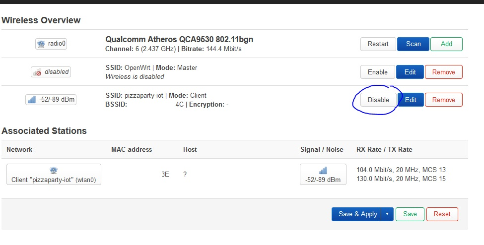

Now press the *Scan* button next to the entry for `radio0`.

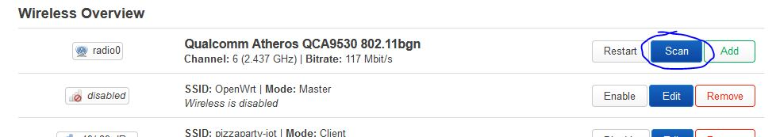

Find the new wireless network you want to connect to and press the *Join Network* button to the right of it.

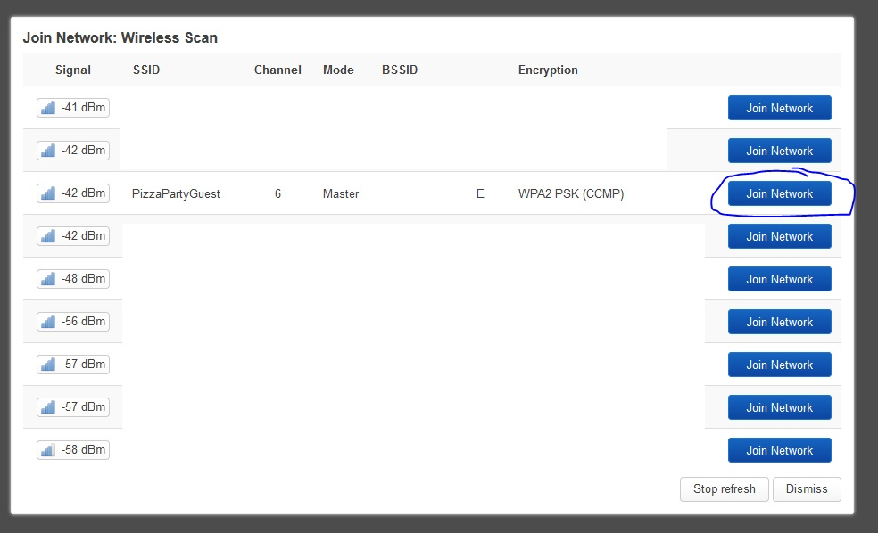

In the resulting dialog, enter a name in the `Name of the new network` field and enter the network password in the `WPA passphrase` field before pressing the *Submit* button.

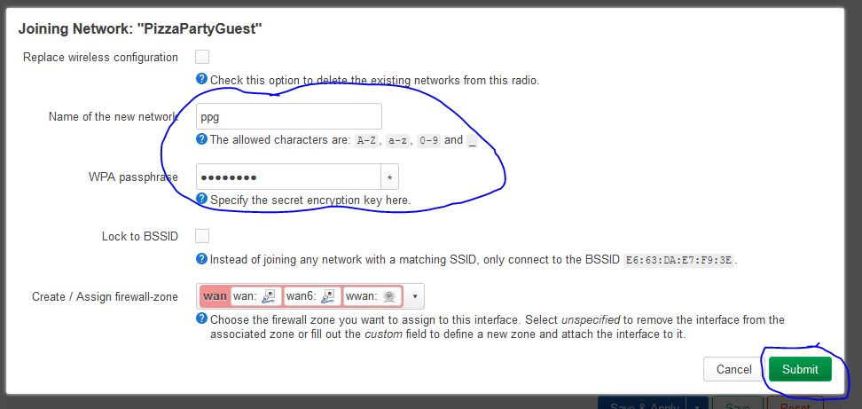

In the next dialog, press the *Save* button.

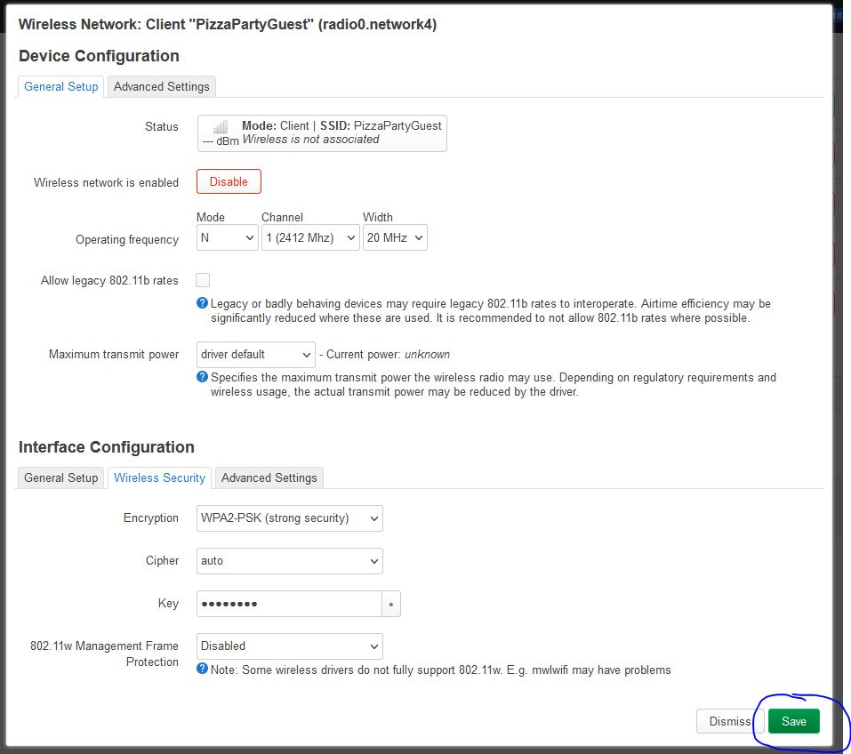

Back on the *Wireless Overview* page, press the *Save & Apply* button.

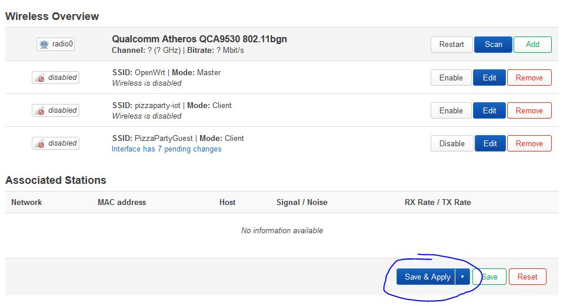

The new network should connect!

If you already have OpenVPN running during this step, you will want to either power cycle the router, or by stopping and starting the OpenVPN connection. To do the latter, navigate to *VPN* --> *OpenVPN*.

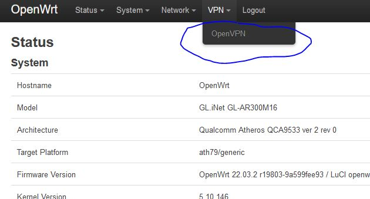

On the OpenVPN page, press the *stop* button in the row for our OpenVPN instance. After it has stopped, press the *start* button that will replace it in the same row.

