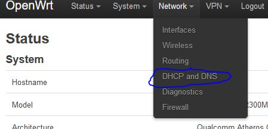
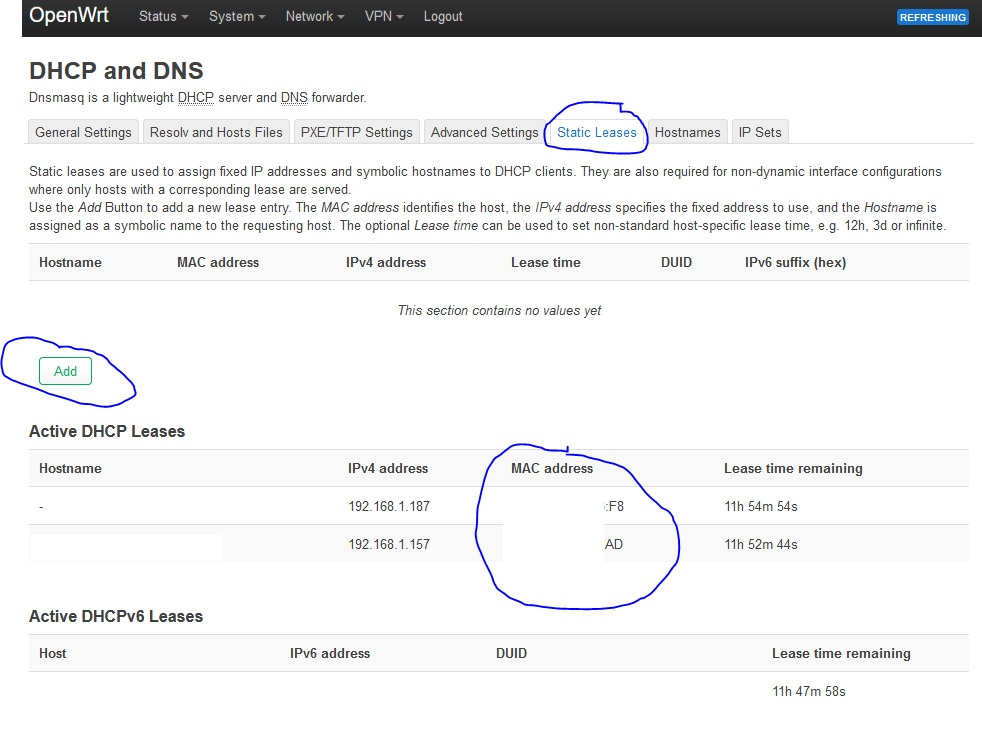
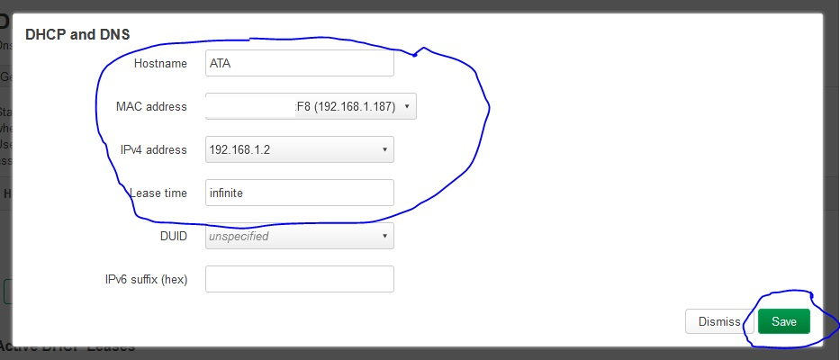

# Port Forwarding on OpenWRT

We may want to get into our router or ATA remotely so it is a good idea to port forward necessary ports to our VPN network.

## Setting an IP Reservation

Navigate to the web interface at http://192.168.1.1 and go to *Network* --> *DHCP and DNS*.

 Select the tab for *Static Leases*, view the current DHCP leases in the *Active DHCP Leases* list. Identify the entry for the ATA (reference the *MAC address* field against the sticker on the bottom of the ATA) and note the MAC address before clicking on the *Add* button.
 
 

In the resulting popup, select the corresponding MAC address from the *MAC Address* dropdown. In the *IPv4 Address* dropdown, enter the IP address for the ATA you want (likely `191.168.1.2`). In the *Hostname* field enter in `ATA` and in the *Lease time* field enter `infinite`. Next, press the "Save" button. 

 

Then on the bottom of the *DHCP and DNS* page press the button for *Save & Apply*.

You may need to unplug/replug the ethernet cable for the ATA to have the new IP address used.

## Set up Port Forwarding

Go to *Network* --> *Firewall* and the navigate to the *Port Forwards* tab. Press the button for *Add*. On the *General Settings* tab of the resultin dialog, enter *grandstream_http* into the *Name* field, `TCP` into the *Protocol* field, `philtel_fw` in the *Source Zone* field, `8080` in the *External port* field, `lan` in the *Destination zone* field, the IP address of the ATA (likely `192.168.1.2`) in the *Internal IP address* field, and `80` in the *Internal port* field. Then press the *Save* button.

 !Add](3-gl-ar300m16-port-forwarding/3-gl-ar300m16-port-forwarding-04.jpg)

Finally on the bottom of the *Port Forwards* page press the button for *Save & Apply*.

Now, from the VPN server you should be able to remotely access the ATA's web interface through port `8080` on the internal VPN `10.8.0.x` IP address if needed.