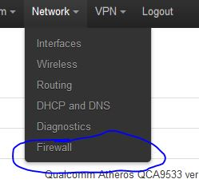
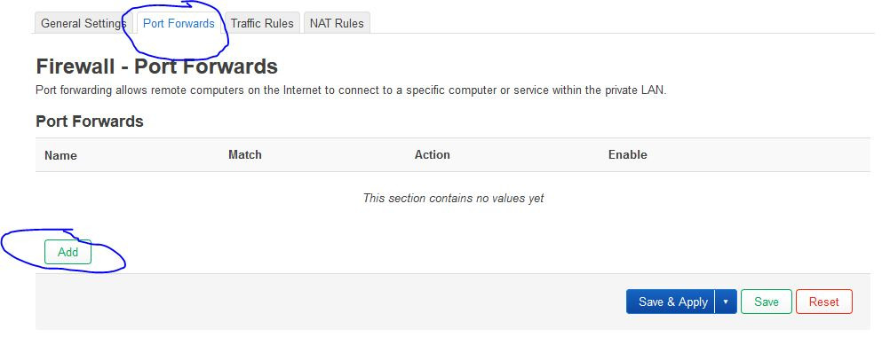
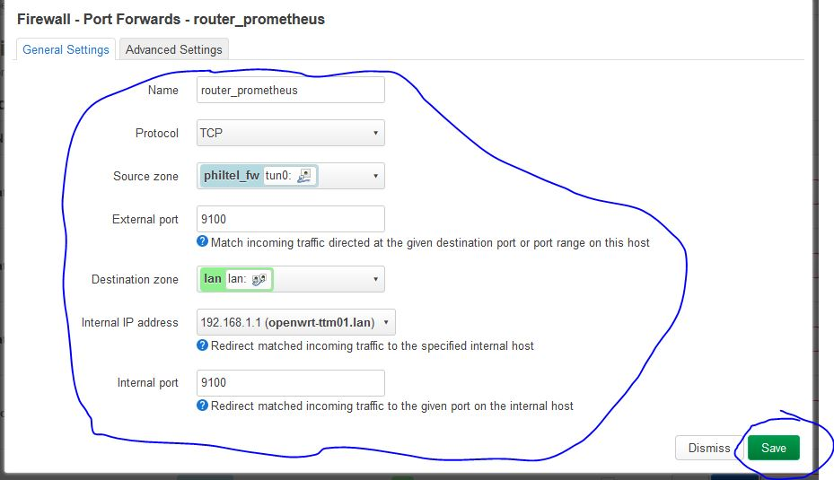
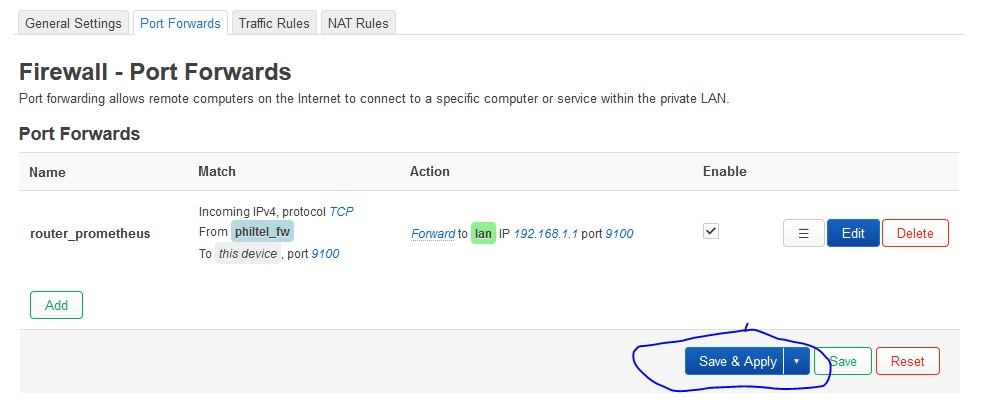

# OpenWRT Metrics

We want to get metrics from our setup, so lets utilize `prometheus` monitoring!

## Install node-exporter Packages

`ssh` into your router at `192.168.1.1` through your terminal/console client of choice.

Note: Make sure you set a password for root before doing this step (you likely did this during the second OpenWRT flash), you will not be able to perform an update until you do.

```
$ ssh root@192.168.1.1
```

Next, perform an update and install OpenVPN packages for `node-exporter` and `nano`:

```
# opkg update
# opkg install prometheus-node-exporter-lua \
prometheus-node-exporter-lua-nat_traffic \
prometheus-node-exporter-lua-netstat \
prometheus-node-exporter-lua-openwrt \
prometheus-node-exporter-lua-wifi \
prometheus-node-exporter-lua-wifi_stations \
nano
# reboot
```

Now we need to edit the `/etc/config/prometheus-node-exporter-lua` file and make sure it contains the following:

```
# nano /etc/config/prometheus-node-exporter-lua
config prometheus-node-exporter-lua 'main'
        option listen_interface 'lan'
        option listen_port '9100'
```

Then, restart the service:

```
/etc/init.d/prometheus-node-exporter-lua restart
```

## Change Hostname

You likely have already done this step but if not, proceed below.

Once logged into the router, navigate to *System* --> *System*


Now, give the router an appropriate `Hostname` based on the installation location and set the proper `Timezone` before pressing the *Save & Apply* button.


## Set up Port Forwarding

You likely have already done this step but if not proceed below.

Go to *Network* --> *Firewall*.



Navigate to the *Port Forwards* tab and press the button for *Add*. 



On the *General Settings* tab of the resulting dialog, enter:
* `router_prometheus` into the *Name* field
* `TCP` into the *Protocol* field
* `philtel_fw` in the *Source zone* field
* `9100` in the *External port* field
* `lan` in the *Destination zone* field
* `192.168.1.1` in the *Internal IP address* field
* `9100` in the *Internal port* field. 

Then press the *Save* button.



Finally on the bottom of the *Port Forwards* page press the button for *Save & Apply*.



## Sources

* <https://grafana.com/blog/2021/02/09/how-i-monitor-my-openwrt-router-with-grafana-cloud-and-prometheus/>