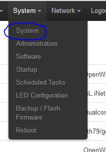
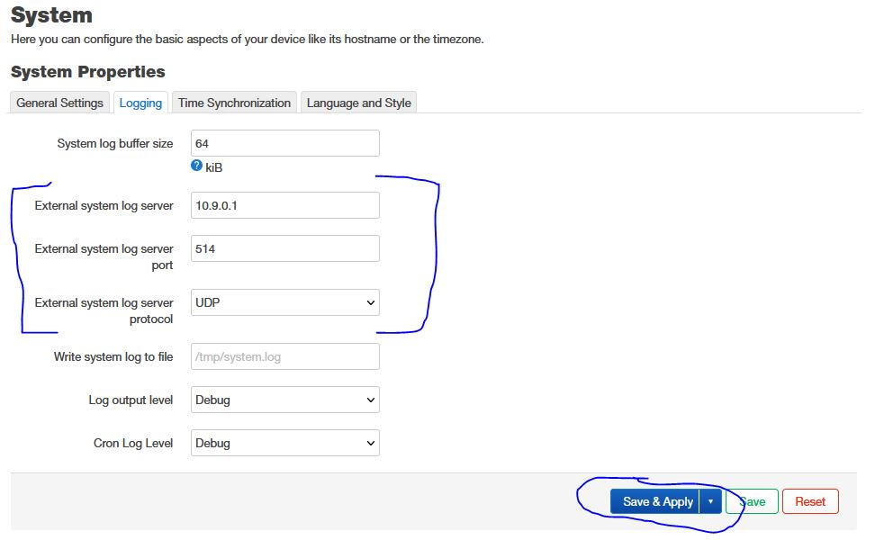

# OpenWRT Logging

We want to get logs from our setup, so lets utilize remote logging!

## Change Hostname

You likely have already done this step but if not, proceed below.

Once logged into the router, navigate to *System* --> *System*

On the *Logging* tab, enter the local VPN IP address running our RSyslog server as `External system log server`, use port `514` as `External system log server port`, and be sure that `UDP` is selected as `External system log server protocol`. Then, press the *Save & Apply* button.

