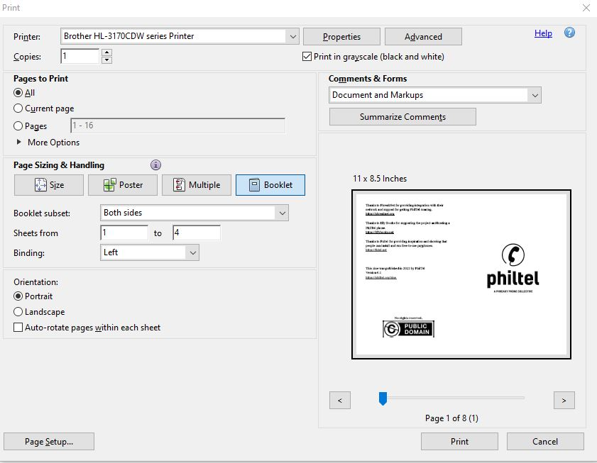
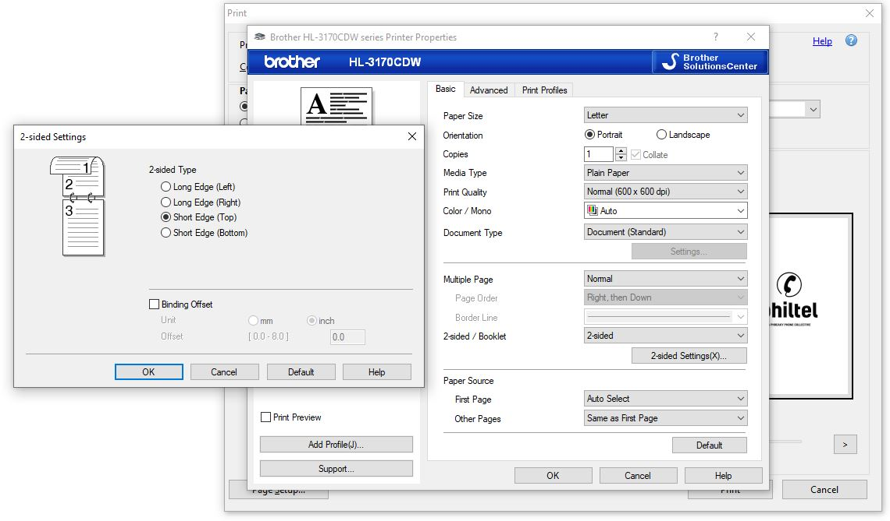

# Zine Printing

I always forget how to print zines so here is a guide I can follow.  

This assumes you have a zine ready to print. It becomes easy if each page is 8.5" x 5.5" so the pages can be folded over.  

In Acrobat, go to *Print*. Under *Page Sizing & Handling* select `Booklet`, set *Booklet subset* to `both sides`. *Sheets from* should be `1` to `4` and *Binding* should be `Left` but I think these are defaulted. *Orientation* can be set to `Portrait`.  

On the Print dialog, press the button for *Properties*. In the new dialog, make sure *Multiple Page* is set to `Normal` and *2-sided / Booklet* is set to `2-sided`. Press the button labeled *2-sided Settings(X)...* and make sure the radio button for `Short Edge (Top)* is selected under *2-sided Type*. Press the *OK* button in each dialog and then press *Print*.  